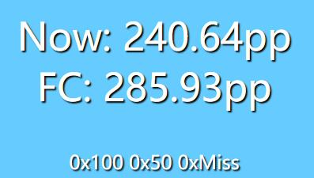
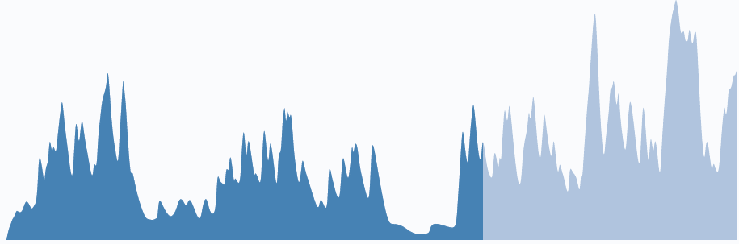

# How to set parameters
Add '?' after the URL, use {key} = {value} format to set the parameters, multiple parameters use '&' to connect.

e.g. 
```
htpp://localhost:10801/rtpp.html?pp_ppformat=${rtpp@1}pp&hit_format=&fps=10
```

# [rtpp.html](rtbpm.html)
Show your pp in browser or OBS's browser source

|Argument Name|Default Value|Note|
|---|---|---|
|host| localhost | ODDR API Server |
|port|10800|ODDR API Server Port|
|digits|2||
|fps|30||
|pp_format|null|Custom PP format. if it's null, get pp format from RTPPD.|
|hit_format|null|Custom Hit Count format. if it's null, get hit count format from RTPPD.|



# [rtbpm.html](rtbpm.html)
Show the BPM of the song you are playing. Real-Time :D

|Argument Name|Default Value|Note|
|---|---|---|
|host| localhost | ODDR API Server |
|port|10800|ODDR API Server Port|


# [fade-inout-bg.html](fade-inout-bg.html)
Fade Backgournd

|Argument Name|Default Value|Note|
|---|---|---|
|host| localhost | ODDR API Server |
|port|10800|ODDR API Server Port|


# [visualizer.html](visualizer.html)/[visualizer-wave.html](visualizer-wave.html)
Audio visualization of the current song

|Argument Name|Default Value|Note|
|---|---|---|
|host| localhost | ODDR API Server |
|port|10800|ODDR API Server Port|
|line_width|5|Line width|


# [ppvisualizer.html](ppvisualizer.html)
PP visualization of the beatmap

|Argument Name|Default Value|Note|
|---|---|---|
|host| localhost | ODDR API Server |
|port|10800|ODDR API Server Port|
|diff_aim|1||
|diff_speed|1||



[Demo(visualizer-wave, rtpp, rtppbpm)](https://youtu.be/XBA8SROobWg)
